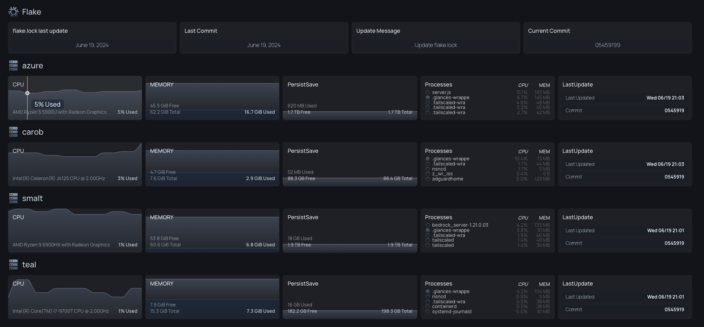

# Nix Flake 

Flake for my personal desktop and self hosted services.  
Attempting to view the Flake and it's nixos hosts as a single logical unit, rather than trying to manage a collection of multiple computers.

# Featues

### Selfhosting

* Homelab/selfhosting focus with multiple docker and nixos container modules for various servers and services.
* Programatically configured [Dashboard](https://github.com/gethomepage/homepage) that automatically expands as new hosts are added to the flake. Dashboard monitors host status, the current Nix Flake revision installed on each system, and the current revision on Gitlab.
* Programatically configured uptime monitoring with [Gatus](https://github.com/TwiN/gatus), no matter which host a new service is deployed on, the Gatus server will automatically update its configuration to include the new service - Homepage dashboard also does the same with links to all current services automatically.
* Programatically configured notifications and monitoring for failed Nixos updates and zfs backups, server and service downtime etc with [Ntfy](https://github.com/binwiederhier/ntfy) and [Gatus](https://github.com/TwiN/gatus).
* Detailed Tailscale modules for general VPN access, initrd ssh access, docker and nixos container configuration etc.
* All Flake networking is heavily reliant on Tailscale, meaning automatic HTTPS certificates for all services, automatic DNS records, controlled Zero Trust access between all devices, no open ports required on any device. Additionally, no reliance on LAN for networking, so I can move any server to any network without any additional configuration required. Tailscale ACL is configured with Pulumi [here](https://github.com/yomaq/Tailscale-ACL).

### Installation and Updates

* The installation of NixOS is made convenient and consistent through [declarative partitioning of disks](https://github.com/nix-community/disko/tree/master), and [a single install ssh command](https://github.com/nix-community/nixos-anywhere/tree/main) (+ additional setups if encrypted).
* Github Actions automatically updates the flake.lock weekly and run basic checks on the updates.
* All NixOS systems are set to automatically check for updates every hour, keeping all hosts in sync and identical as possible.
* The flake is designed to be modular, making it easy to add to, and ensuring that all host outputs, whether NixOS or MacOS, look as similar as possible.

### Backups, File Management and Secrets
* Ensures a clean system on every reboot by wiping root (rolling back an empty zfs snapshot), while [preserving](https://github.com/nix-community/impermanence) specified files across reboots.
* The files that are designated to persist are all stored in a single location, enabling automated backups that only include important files.
* Backup server which automatically schedules new backup tasks as additional hosts are added to the flake by default.
* The flake manages the entire system, including [secrets](https://github.com/ryantm/agenix/tree/main).

## Host Status Dashboard
Using the git revision of the flake, you can easily see which hosts are out of date.




<details>
  <summary>Build on NixOS</summary>

**Install a host that already has configuration:**

* boot the host into a nixos installer, and set the root password
* complete the following steps on a different x86_64 machine with nix installed, and signed into 1password
* run the script `utilities/nixos-anywhere/remote-install-encrypt.sh HOSTNAME IPADDRESS-OF-TARGET`
* let the install complete, then unlock the drive manually (initrd ssh will not work yet)
* hit * to ignore the error after unlocking if needed
* remake the /etc/ssh/initrd host key and rebuild the nixos configuration
* now upon rebooting, the system will have normal behavior and initrd ssh will function


**Update the system(rebuild)**:  
```
nixos-rebuild switch --flake github:yomaq/nix-config
```
</details>

<details>
  <summary>NixDarwin (MacOS) Setup</summary>

Install Nix on MacOS:
https://nixos.org/download.html#nix-install-macos
(not tested, but likely better https://zero-to-nix.com/concepts/nix-installer)

```
sh <(curl -L https://nixos.org/nix/install)
```
Install Nix-Darwin (use all defaults):
https://github.com/LnL7/nix-darwin
```
nix-build https://github.com/LnL7/nix-darwin/archive/master.tar.gz -A installer
./result/bin/darwin-installer
```
Enable Flakes:
https://nixos.wiki/wiki/Flakes
```
mkdir -p ~/.config/nix
echo "experimental-features = nix-command flakes" >> ~/.config/nix/nix.conf
```
Install Homebrew: https://docs.brew.sh/Installation
(a couple packages are installed through homebrew as the nixpkgs appear broke on mac even tho they say it is supported)
```
/bin/bash -c "$(curl -fsSL https://raw.githubusercontent.com/Homebrew/install/master/install.sh)"
```
Get the flake
```
git clone https://github.com/yomaq/nix-config.git
cd nix-config
```
Remove the old nix.conf 
```
sudo rm -f /etc/nix/nix.conf
```
Change computer name to match config
```
sudo scutil --set HostName midnight
```
***Repeat the following step each time you build new updates***

Build Darwin
```
darwin-rebuild switch --flake .
```
Or to build without cloning
```
darwin-rebuild switch --flake github:yomaq/nix-config
```
</details>


<details>
  <summary>ToDo</summary>

* Setup WSL ideally with the option to have nix configured GUI applications as well
* Add [Nixvirt](https://github.com/AshleyYakeley/NixVirt) based VMs
* Test out a self hosted Hydra server
* Add a self hosted Cachix server


</details>